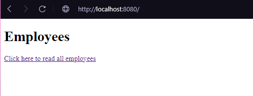
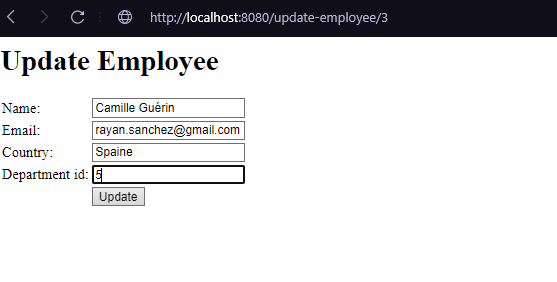

# Міні-CRM (Яковлева М.А.)
Є люди та департаменти.
Можна створювати та змінювати людей
Можна ставити людям 1 чи кілька департаментів.

### Використані технології:
- JDK 13
- Spring MVC
- Spring Data JPA
- Lombok
- H2DB

### Проходження тестів
 

### Запуск
docker-compose up --build -d

### Опис сторінок програми
docker-compose up --build -d
Перша індекс-сторінка

Сторінка додавання запису

Список записів

Оновлення запису

